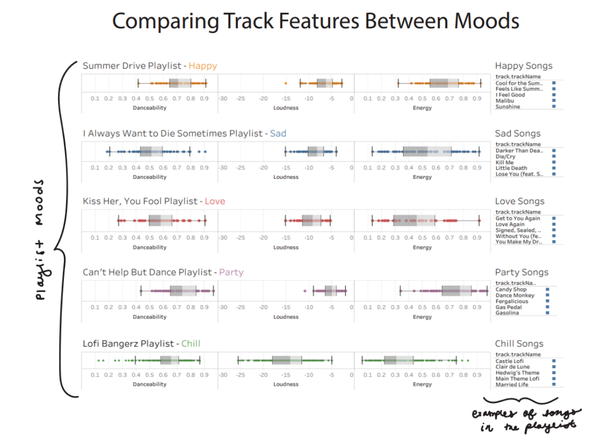

# Spotify Data Analysis and Visualization
## Purpose
For this project, I aimed to visually represent how song features vary across different listener moods. Utilizing playlist titles as indicators of overarching mood categories—such as happy, sad, love, party, and chill—I selected five playlists that seemed to align with these moods. For instance, I categorized the "Summer Drive" playlist as "Happy," "I Always Want to Die Sometimes" as "Sad," "Kiss Her, You Fool" as "Love," "Can’t Help But Dance" as "Party," and "Lofi Bangerz" as "Chill." Subsequently, I visualized song features like danceability, loudness, and energy within each playlist to analyze variations between moods.

## Data
Data in this folder are Spotify exports from individuals, which have been de-identified and combined into collections by type.  Tracks, artists, episodes, and more have then been queried against the Spotify API https://developer.spotify.com/documentation/web-api for detailed information on the objects.  

For this project I used the the trackFeatures.csv. Detailed audio features (measurements) of each track, for understanding the music's characteristics or how the music feels.  

Fields: danceability, energy, key, loudness, mode, speechiness, acousticness, instrumentalness, liveness, valence, tempo, track.id, duration_ms, time_signature  

See https://developer.spotify.com/documentation/web-api/reference/get-audio-features for explanations of what each measurement means and the scale of values used.

## Process

In my design process, I made deliberate choices to explore these song characteristics between moods. Initially, I utilized box and whisker plots to illustrate the median and variance of each characteristic, because they are easy to compare between playlists. Additionally, I opted for an orange color to represent "happy," as warm tones conventionally symbolize happiness in Western culture.

Then, I started including additional moods as you can see in the visual below. As I expanded to include more moods, I adjusted colors to correspond with mood categories—orange for happy, blue for sad, red for love, purple for party/dance, and green for chill.

To ensure easy comparison of median values between moods, I standardized the scale of each feature across all moods, aligning the bars consistently. Moreover, I integrated song titles within playlists to provide context and evidence of alignment between playlist titles and song contents. This coherence aimed to foster trust in the visualization's results among viewers. I was ultimately trying to convince or provide evidence that the songs within the playlist align with the playlist title/mood. 

To do this I used the “dashboard” feature within Tableau which made it especially easy to compile different sheets that I had created. The dashboard feature made it easy to maintain consistency between spacing between visualizations (which was not the case when I simply tried to compile them by hand in Illustrator). Using the Dashboard feature was essential in creating a complicated visual composed of many features while keeping it looking neat and organized. 

I then exported my visual into Illustrator and added a title that aligned with the title of the assignment “Between Things” as I was interested in looking at track features “Between Moods”. I also included some handwritten annotations. Handwritten annotations were incorporated to infuse a personalized touch, enhancing viewer engagement. Handwritten annotations seem to allow the viewer to connect with the visual more, directing the eye towards the axis so that the viewer more easily understands what to look at.

Throughout this assignment, I gained many insights into data visualization. Initially, I discovered the complexity involved in creating visualizations, especially when dealing with data from multiple spreadsheets. Ensuring alignment between datasets was challenging but ultimately taught me the importance of not letting data format dictate visualization choices. Instead, I focused on identifying key features across playlists and determining the best visualization approach. This process led me to explore various features of Tableau, including joins, dashboards, filtering, and modifying variable ranges, which enhanced my skills significantly.

Regarding the visualization itself, I'm happy with how it came out. While some of the actual results of the visualization reinforced my expectations, such as mood-related trends in song features, there were also surprises, like similarities between certain playlists. However, I acknowledge concerns about potential clutter in the visualization as I attempted to compare more than a couple different moods which involved more data and therefore making it more difficult to maintain an organized layout. I attempted to maintain organization through consistent spacing, color differentiation, and clear annotations. Yet, I realize that I may have included too many variables, leading to repetition. One improvement I considered was listing the track features label and song title label only once, rather than for every playlist, to reduce visual clutter and enhance clarity. Overall, I'm eager to hear feedback from my peers on the visualization's effectiveness and clarity.

